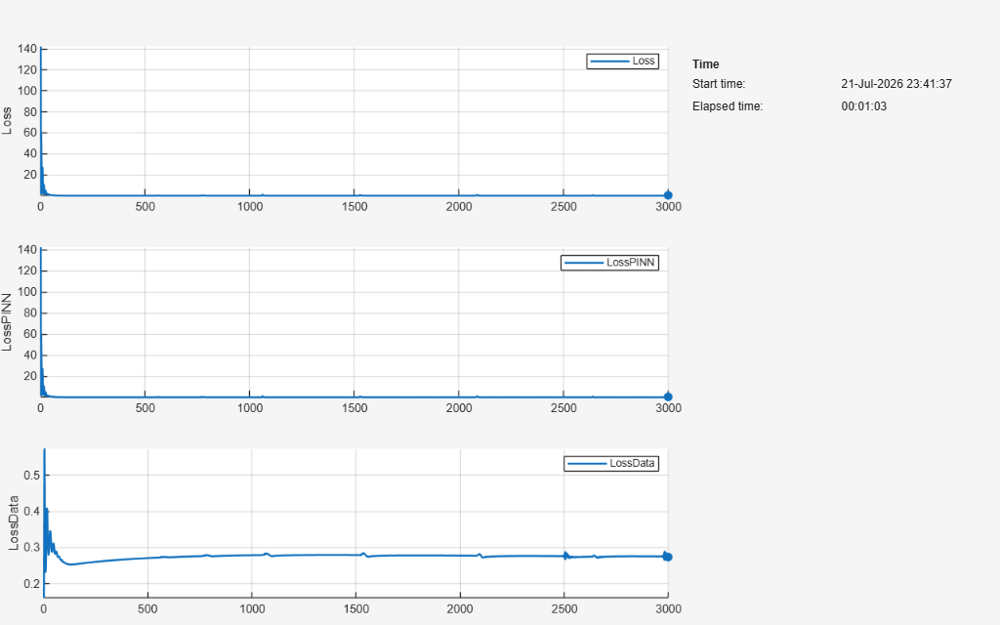
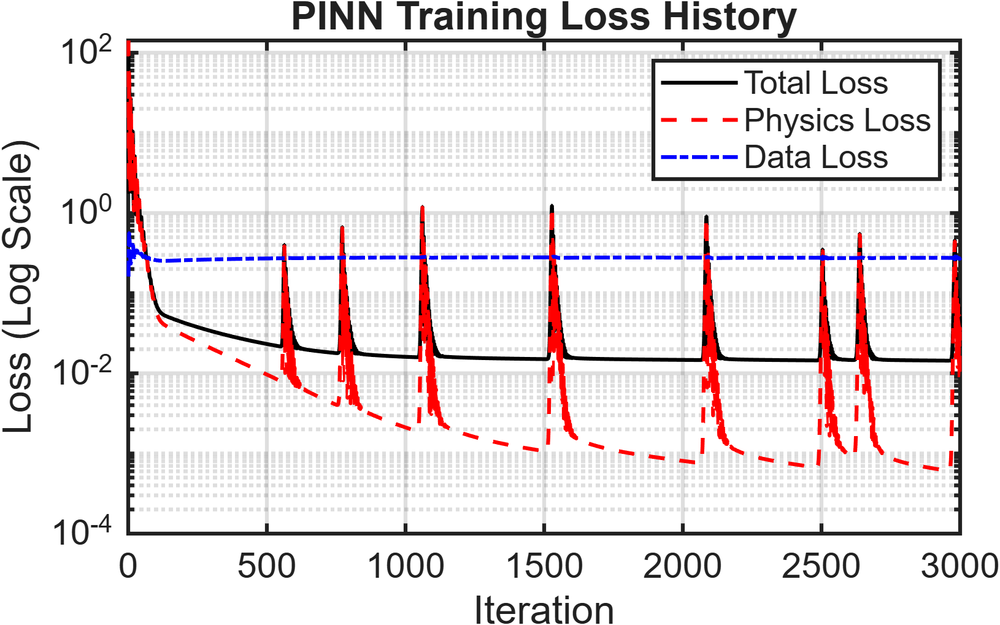
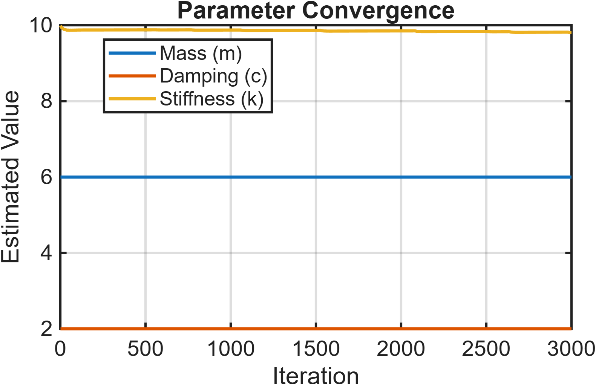

## Results

### Training Progress

Visualization of the PINN training process.

---

### Loss History

Evolution of the total loss, physics loss, and data loss during training.

---

### Parameter Convergence

Convergence of the estimated mass (**m**), damping coefficient (**c**), and spring stiffness (**k**) toward their true values.

